# 🌦️ ClimaSKT React Project

A modern, feature-rich weather dashboard built with React, TypeScript, and Vite. Get real-time weather updates, forecasts, and more—all with a beautiful, responsive UI.

---

## 🚀 Features

- **Live Weather Dashboard:** Instantly see your local weather with geolocation support. View current temperature, conditions, wind, pressure, sunrise/sunset, and more.
- **Hourly & 5-Day Forecasts:** Visualize upcoming weather trends with detailed hourly and daily forecasts.
- **City Search & Quick Navigation:** Search for any city worldwide and jump to its weather instantly. Recent searches and favorites for fast access.
- **Favorite Cities:** Pin your favorite locations for one-click weather checks. Remove favorites with a single click.
- **Responsive & Themed UI:** Fully responsive design for desktop and mobile. Dark/light mode toggle for comfortable viewing.
- **Error Handling & Loading States:** Friendly error messages and skeleton loaders for a smooth experience.
- **Powered by OpenWeatherMap API**

---

## 🖼️ Screenshots & Feature Highlights

Below are some highlights of ClimaSKT's features, each with a visual example:

---

### 🌍 Live Location Weather
See your current weather instantly with geolocation support.

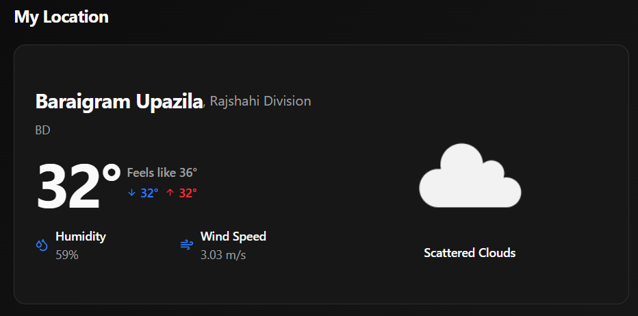

---

### 🌓 Dark & Light Mode
Switch between beautiful dark and light themes for comfortable viewing.

| Dark Mode | Light Mode |
|-----------|-----------|
| 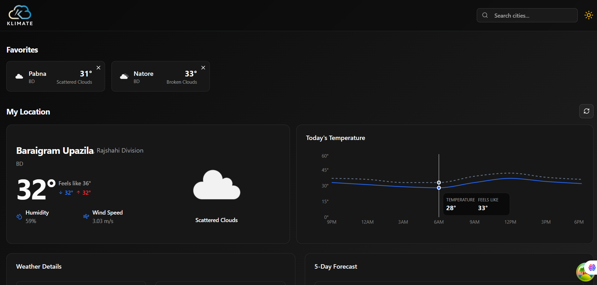 | 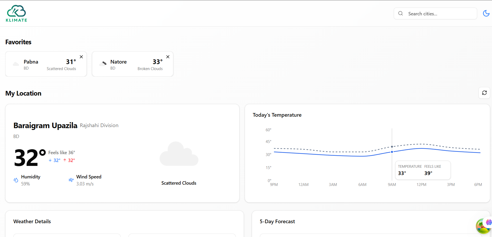 |

---

### ⏰ Hourly & 5-Day Forecasts
Visualize upcoming weather trends with detailed hourly and daily forecasts.

- **Hourly Forecasts:**
  
  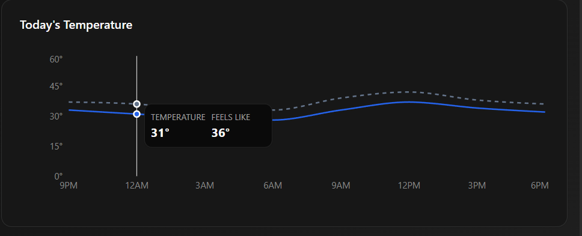

- **5 Day Forecast:**
  
  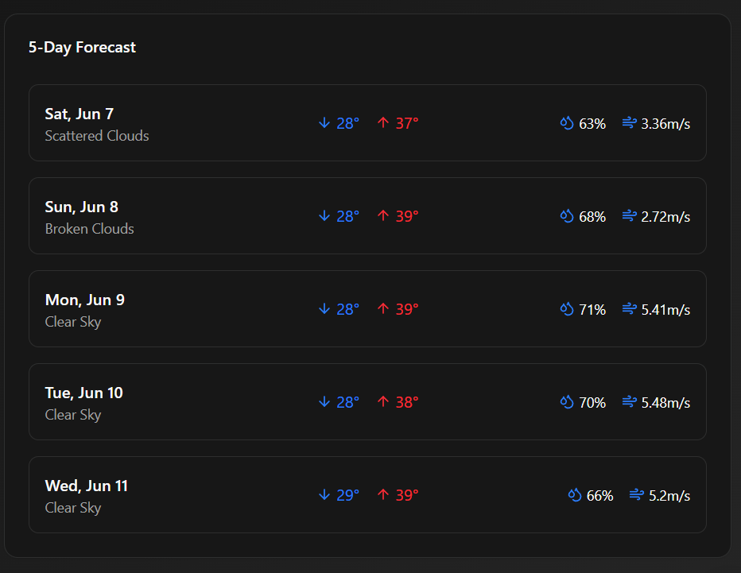

---

### 📋 Weather Details
Get in-depth weather information including wind, pressure, sunrise, and sunset times.

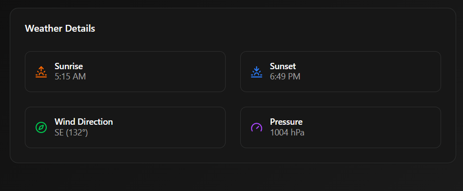

---

### 🔍 City Search & Smart Suggestions
Search for any city worldwide and get instant, smart suggestions as you type.

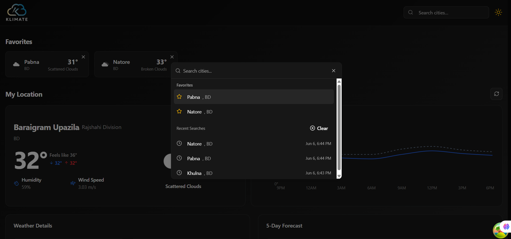
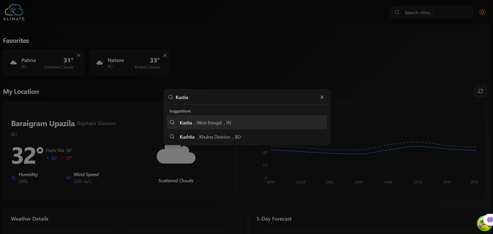

- **Detailed Search Results:**

  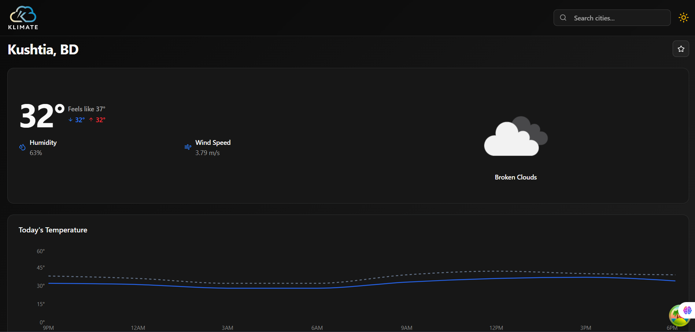

---

### ⭐ Favorite Cities
Pin your favorite locations for one-click weather checks. Remove favorites with a single click.

| Favorites List | Remove Favorite | Favorite Removed |
|---------------|----------------|-----------------|
| 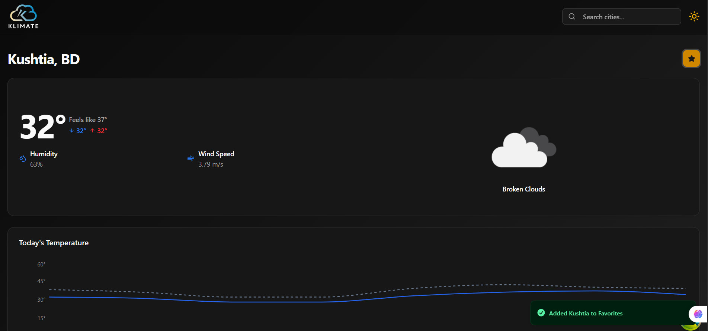 | 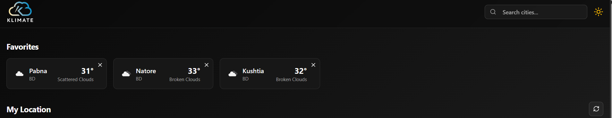 | 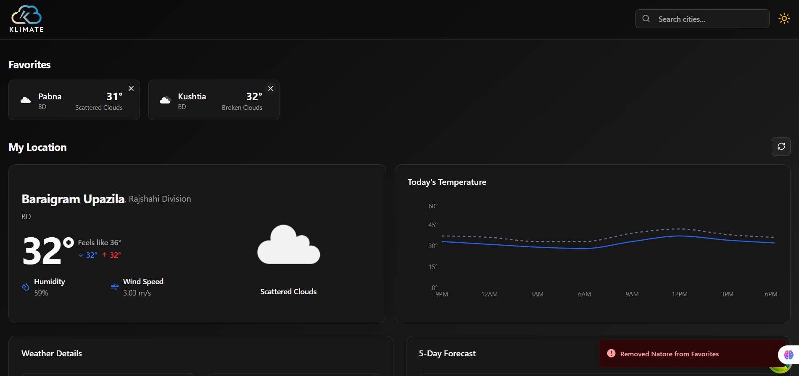 |

---

### 🕑 Search History
Your recent searches are saved for quick access. Clear your history with a single click.

| Search History | Clear History |
|----------------|--------------|
|  | 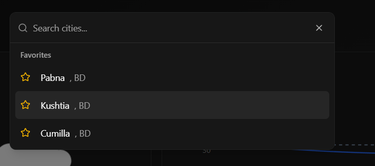 |

---

## 🖥️ Tech Stack

- **React 18** + **TypeScript**
- **Vite** for lightning-fast development
- **TanStack Query** for data fetching and caching
- **Shadcn UI** for accessible, customizable UI components
- **React Router** for navigation
- **Tailwind CSS** for styling
- **OpenWeatherMap API** for weather data

---

## ⚡ Quick Start

1. **Clone the repo:**

   ```sh
   git clone https://github.com/yourusername/clima_skt-react-project.git
   cd clima_skt-react-project
   ```

2. **Install dependencies:**

   ```sh
   npm install
   ```

3. **Set up your OpenWeatherMap API key:**
   - Create a `.env` file and add your API key as per `src/apis/config.ts`.

4. **Run the app:**

   ```sh
   npm run dev
   ```

5. **Open in browser:**
   - Visit [http://localhost:5173/clima_skt-react-project](http://localhost:5173/clima_skt-react-project)

---

## 🛠️ Project Structure

```text
src/
  pages/         # Main application pages (Dashboard, CityView, NotFound, etc.)
  components/    # Reusable UI and feature components
  apis/          # API configuration, endpoints, and TypeScript data types
  hooks/         # Custom React hooks
  context/       # React context providers for theme, favorites, and global state
  utils/         # Utility functions and helpers
  assets/        # Static assets (images, icons, fonts)
  styles/        # Global styles and Tailwind configuration
  routes/        # Route definitions and navigation helpers
  tests/         # Unit and integration tests
```

> This structure keeps your codebase modular, scalable, and easy to maintain.

---

## ✨ Why You'll Love It

- **Blazing fast** thanks to Vite and React Query
- **Beautiful UI** with modern design and smooth interactions
- **Easy to extend** and customize for your own needs
- **Great developer experience** with TypeScript and modular code

---

## 📄 License

MIT

---

> Made by Shakhoyat ❤️ — Happy Coding!